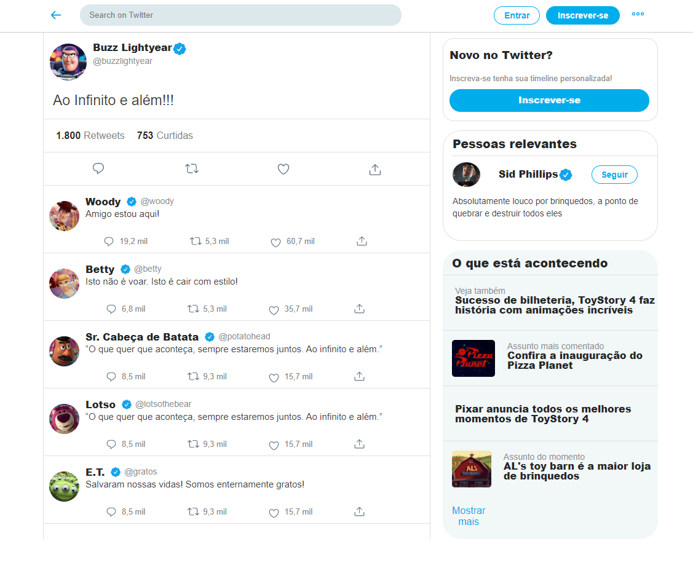

# Interface do Twitter do Buzz Lightyear

--
### Interface do Twitter com somente HTML e CSS estático, fixando alguns conhecimentos sobre FlexBox.

- No arquivo index.html temos a página principal do Buzz Lightyear

- No arquivo post.html temos a página de um tweet do Buzz, junto com algumas interações de amigos dele.

